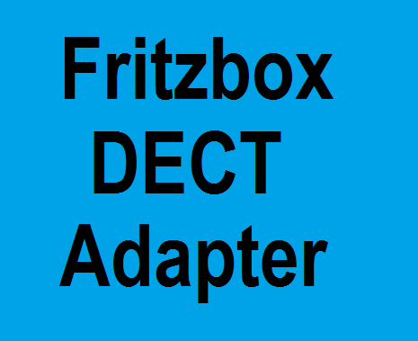

# ioBroker.fritzboxdect

## Fritzboxdect adapter for ioBroker

Adapter for Fritzbox DECT Devices

## Allgemeine Infos
* Die Gültigkeit der SID wird bei jeder Aktion überprüft. Dadurch hält ein Login bis die Fritzbox wegen anderen Login Fehler alle Benutzer kurz sperrt.
* Befehle während der Login-Sperre werden gehalten und versendet, sobald die Verbindung zur Fritzbox wieder hergestellt wird.
* Es werden nur Datenpunkte aktuallisert die sich geändert haben.

## Konfig
* IP (Pflichtfeld)
  Hier bitte nur die IP eintragen. Bsp.: 192.168.178.1

* Benutzname (Pflichtfeld)
  Bitte einen Benutzer in der Fritzbox mit den Rechten Smart Home, Einstellungen und APP anlegen

* Passwort (Pflichtfeld)
  Das Passwort vom angelegten Benutzer

* Intervall DECT (Pflichtfeld)
  Datenpunkte der DECT Geräte und Gruppen aktualisieren (optimal sind 2 Sekunden)

* Intervall komplett DECT (Pflichtfeld)
  Alle Datenpunkte werden aktualisiert auch wenn nicht geändert wurde (Eingabe in Stunde)

* Intervall Template (Pflichtfeld)
  Wie oft sollen die Templates aktualisiert werden (Eingabe in Stunden - 1 x am Tag sollte reichen)

* Booster Zeit
  Zeit die bei hkr.boostactive angewendet werden soll (Thermostate)

* Open minutes
  Zeit die bei hkr.windowopenactiv angewendet werden soll (Thermostate)

* HTTPS verwenden
  Verwendung von HTTPS

## Bekannte Geräte
## FRITZ!DECT 200/210
*  Datenpunkte die gesetzt werden können
   - powermeter.loadpowerstatic: Lädt die Power Statistik (Neues Objekt devicestats wird angelegt)
   - simpleonoff.state: 0=off 1=on 2=toggle
   - switch.state: Aktor an/aus
   - temperature.loadtempstatic: Lädt die Temperatur Statistik (Neues Objekt devicestats wird angelegt)
   - name: Name vom Aktor ändern
   - Für Alexa: Gruppe = switch.state + temperature.celsius um auch die Temperatur ansagen zu lassen

## FRITZ!DECT 301/301 und Comet
*  Datenpunkte die gesetzt werden können
   - hkr.boostactive: Booster Heizung aktivieren - Zeit wird aus der Konfig genommen
   - hkr.boostactiveendtime: Booster Zeit in Minuten eingeben
   - hkr.windowopenactiv: Fentser offen Modus aktivieren - Zeit wird aus der Konfig genommen
   - hkr.windowopenactiveendtime: Zeit für Fenster offen Modus in Minuten eintragen
   - hkr.alexapower: True für Auto und false für Aus
   - hkr.alexaparty: True für 8 Grad und false für Auto
   - hkr.alexamode: 1 für Auto und 0 für Aus
   - hkr.tsoll: Einstellung Thermostat - 8 bis 28°C - on/off - open/closed - true/false - 0=auto, 1=closed, 2=open - 254(open)/253(closed)
   - temperature.loadtempstatic: Lädt die Temperatur Statistik (Neues Objekt devicestats wird angelegt)
     ACHTUNG! open, true, 2 und 254 setzen das HKT auf Max. 28 Grad.
   - name: Name vom Aktor ändern
   - Für Alexa: Gruppe = hkr.tsoll, temperature.celsius, hkr.alexamode, hkr.alexaparty, hkr.alexapower hkr.boostactive

## FRITZ!Powerline 546E
*  Datenpunkte die gesetzt werden können
   - powermeter.loadpowerstatic: Lädt die Power Statistik (Neues Objekt devicestats wird angelegt)
   - switch.state: Aktor an/aus
   - name: Name vom Aktor ändern
   - Für Alexa: switch.state

## FRITZ!DECT Repeater 100
*  Datenpunkte die gesetzt werden können
   - name: Name vom Aktor ändern

## FRITZ!DECT 400
*  Datenpunkte die gesetzt werden können
   - name: Name vom Aktor ändern
   - button.?.name: Name vom Button ändern

## FRITZ!DECT 440
*  Datenpunkte die gesetzt werden können
   - name: Name vom Aktor ändern
   - button.?.name: Name vom Button ändern
   - Für Alexa: Gruppe = celsius und rel_humidity für die jeweilige Abfrage

## FRITZ!DECT 500
*  Datenpunkte die gesetzt werden können
   - colorcontrol.loadcolor: Lädt die möglichen Farben (Neues Objekt devicecolor wird angelegt)
   - colorcontrol.saturation und colorcontrol.hue für die Farben. Achtung!! Erst saturation und sofort hue setzen. Der trigger liegt bei hue und saturation wird ausgelesen.
   - colorcontrol.temperature: Setzen der Farbtemperatur
   - colorcontrol.alexaonoff: Licht An oder Aus
   - colorcontrol.huealexa: RGB
   - levelcontrol.level: Licht dimmen 0 (0%) bis 255 (100%)
   - levelcontrol.levelpercentage: Licht dimmen 0% - 100%
   - simpleonoff.state: 0=off 1=on 2=toggle
   - name: Name vom Aktor ändern
   - Für Alexa: Gruppe = colorcontrol.temperature, colorcontrol.alexaonoff, colorcontrol.huealexa und levelcontrol.levelpercentage

## Rollotron 1213
*  Datenpunkte die gesetzt werden können
   - levelcontrol.alexaclose: True = Rolllade schließen
   - levelcontrol.alexalevel: 0%=geschlossen und 100%=geöffnet
   - levelcontrol.alexaopen: True = Rolllade öffnen
   - levelcontrol.alexastop: True = Stoppen
   - levelcontrol.level: 0(0%)=geöffnet und 255(100%)=geschlossen
   - levelcontrol.levelpercentage: 0%=geöffnet und 100%=geschlossen
   - name: Name vom Aktor ändern
   - Für Alexa: levelcontrol.alexavalue, levelcontrol.alexaclose, levelcontrol.alexalevel, levelcontrol.alexaopen und levelcontrol.alexastop

## HAN-FUN Tür/Fensterkontakt
*  Datenpunkte die gesetzt werden können
   - name: Name vom Aktor ändern
   - Für Alexa: alert.state

## Changelog

### 0.0.1

* (Lucky-ESA) initial release

## License

MIT License

Copyright (c) 2021 Lucky-ESA <lucky@luckyskills.de>

Permission is hereby granted, free of charge, to any person obtaining a copy
of this software and associated documentation files (the "Software"), to deal
in the Software without restriction, including without limitation the rights
to use, copy, modify, merge, publish, distribute, sublicense, and/or sell
copies of the Software, and to permit persons to whom the Software is
furnished to do so, subject to the following conditions:

The above copyright notice and this permission notice shall be included in all
copies or substantial portions of the Software.

THE SOFTWARE IS PROVIDED "AS IS", WITHOUT WARRANTY OF ANY KIND, EXPRESS OR
IMPLIED, INCLUDING BUT NOT LIMITED TO THE WARRANTIES OF MERCHANTABILITY,
FITNESS FOR A PARTICULAR PURPOSE AND NONINFRINGEMENT. IN NO EVENT SHALL THE
AUTHORS OR COPYRIGHT HOLDERS BE LIABLE FOR ANY CLAIM, DAMAGES OR OTHER
LIABILITY, WHETHER IN AN ACTION OF CONTRACT, TORT OR OTHERWISE, ARISING FROM,
OUT OF OR IN CONNECTION WITH THE SOFTWARE OR THE USE OR OTHER DEALINGS IN THE
SOFTWARE.
