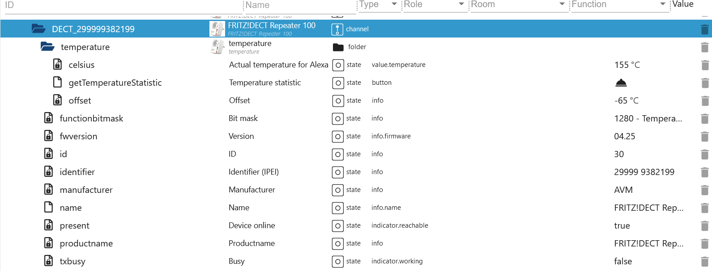
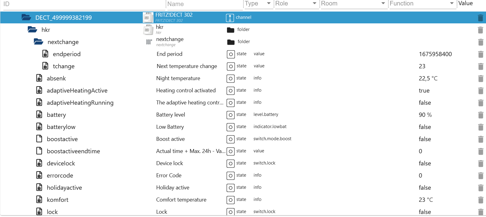
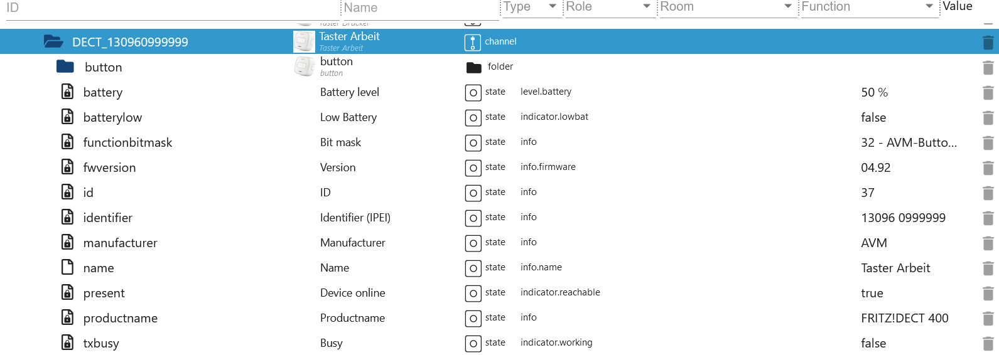

# ioBroker.fritzboxdect

[Zurück zur README](/README.md)

# Summary

-   [Instance Settings](#instance-settings)
    -   [TAB Fritzbox settings](#create-fritzbox)
    -   [TAB Symbole settings](#create-symbole)
-   [Remote control](#remote)
-   [Devices](#dect-devices)
    -   [States readonly](#readonly-states)
    -   [DECT 100](#dect-100)
    -   [DECT 200 und 210](#dect-200---210)
    -   [DECT 300, 301, 302 und Comet](#dect-300-301-302-und-comet)
    -   [DECT 350](#dect-350)
    -   [DECT 400](#dect-400)
    -   [DECT 440](#dect-440)
    -   [DECT 500](#dect-500)
    -   [DECT 546E](#dect-546e)
    -   [DECT Comet](#dect-comet)
    -   [HAN-FUN Rollotron 1213](#han-fun-1213)
    -   [HAN-FUN contact](#han-fun-contact)
    -   [Goups](#groups)
    -   [Template](#templates)
    -   [Trigger](#triggers)

# Instance Settings

### Create Fritzbox

[Summary](#summary)

-   `Active` Fritzbox activate/deactivate
-   `Fritzbox IP` IP Fritzbox
-   `Username` Login Username
-   `Password` Password
-   `Protocol` HTTP od HTTPS
-   `Choose icon` The icon is displayed under Objects. Must first be created under `Choose icon`


-   `Booster` Time to be used with hkr.boostactive (thermostats - in minutes)
-   `Open window` Time to be used for hkr.windowopenactiv (thermostats - in minutes)
-   `DECT interval` Interval for updating DECT and groups. The more devices there are, the longer the update takes and then 1 second doesn't make sense. If the adapter requires longer than the interval, the update is skipped.
-   `Template interval` Interval for updating templates and triggers. Can be deactivated with 0.


### Create symbole

-   `Symbolname` Name of the image. Can then be selected under `ADD Fritzbox`.
-   `Upload` Upload icon


[Summary](#summary)

# Remote

-   States that can be set

    -   `DECT_Control.addColorTemplate`: Create Color Template
        -   `addColorTemplate.createColorTemplates`: Creates a color template
            -   `addColorTemplate.hue_template`: Hue-Value [Please refer JSON](#color-json-dect-500)
            -   `addColorTemplate.saturation_template`: Saturation-value [Please refer JSON](#color-json-dect-500)
        -   `addColorTemplate.createTemperatureTemplates`: Creates a color temperature template
            -   `addColorTemplate.colorTemperature_template`: Value as Kelvin
                ```
                    2700: "Warm white_1"
                    3000: "Warm white_2"
                    3400: "Warm white_3"
                    3800: "Neutral white_1"
                    4200: "Neutral white_2"
                    4700: "Neutral white_3"
                    5300: "Daylight_1"
                    5900: "Daylight_1"
                    6500: "Daylight_1"
                ```
    -   `addColorTemplate.<identifier>`: Which devices should be added to the template (true for add)
    -   `addColorTemplate.colorpreset`: colorpreset==“true” then the color defaults are used, otherwise and in default(false) the color defaults are not used
    -   `addColorTemplate.levelPercentage_template`: Level/level in percent, 0 to 100 percent
    -   `addColorTemplate.name_template`: Name of template
    -   `getsubscriptionstate`: Status DECT-ULE device registration States `subscriptionslatest` and `subscriptionstate` are set
    -   `own_request`: Own request e.g. E.g.: `/webservices/homeautoswitch.lua?switchcmd=getbasicdevicestats&ain=<identifier>` Replace spaces with %20 - URL without `&sid=`
    -   `startulesubscription`: Start DECT-ULE device registration

-   Readonly States
    -   `online` Fritzbox Online yes(true)/no(false)
    -   `sid`: Current session ID
    -   `sid_create` Current session ID created as a timestamp
    -   `subscriptionslatest`: Last registered devices (identifier)
    -   `subscriptionstate`: "0"=login is not running / "1"=login is running / "2"=timeout / "3"=other error

</br>
</br>


[Summary](#summary)

# DECT devices

### Readonly States

-   `functionbitmask`: Bit mask of the device function classes, start with bit 0, several bits can be set
    ```
        Bit 0: HAN-FUN device
        Bit 2: Light/Lamp
        Bit 4: Alarm sensor
        Bit 5: AVM button
        Bit 6: AVM radiator controller
        Bit 7: AVM energy measuring device
        Bit 8: Temperature sensor
        Bit 9: AVM switching socket
        Bit 10: AVM DECT repeater
        Bit 11: AVM microphone
        Bit 13: HAN-FUN unit
        Bit 15: device/socket/lamp/actuator that can be switched on/off
        Bit 16: Device with adjustable dimming, height or level
        Bit 17: Lamp with adjustable color/color temperature
        Bit 18: Roller shutter (blind) - up, down, stop and level 0% to 100%
        Bit 20: Humidity sensor
    ```
-   `fwversion`: Firmware version of the device
-   `id`: Internal device ID
-   `identifier`: Unique ID, AIN, MAC address
-   `manufacturer`: manufacturer
-   `present`: Device connected no/yes
-   `productname`: Product name of the device, empty if unknown/undefined device
-   `txbusy`: Currently sending commands yes(1)/no(0)
-   `etsiunitinfo`: Assignment of HAN-FUN devices
    -   `etsideviceid`: Internal device ID
    -   `interfaces`: HAN-FUN interfaces
    ```
        277 = KEEP_ALIVE
        256 = ALERT
        512 = ON_OFF
        513 = LEVEL_CTRL
        514 = COLOR_CTRL
        516 = OPEN_CLOSE
        517 = OPEN_CLOSE_CONFIG
        772 = SIMPLE_BUTTON
        1024 = SUOTA-Update
    ```
    -   `unittype`: HAN-FUN Unit Typ
    ```
        273 = SIMPLE_BUTTON
        256 = SIMPLE_ON_OFF_SWITCHABLE
        257 = SIMPLE_ON_OFF_SWITCH
        262 = AC_OUTLET
        263 = AC_OUTLET_SIMPLE_POWER_METERING
        264 = SIMPLE_LIGHT
        265 = DIMMABLE_LIGHT
        266 = DIMMER_SWITCH
        277 = COLOR_BULB
        278 = DIMMABLE_COLOR_BULB
        281 = BLIND
        282 = LAMELLAR
        512 = SIMPLE_DETECTOR
        513 = DOOR_OPEN_CLOSE_DETECTOR
        514 = WINDOW_OPEN_CLOSE_DETECTOR
        515 = MOTION_DETECTOR
        518 = FLOOD_DETECTOR
        519 = GLAS_BREAK_DETECTOR
        520 = VIBRATION_DETECTOR
        640 = SIREN
    ```

### DECT 100

[Summary](#summary)

-   States that can be set

    -   `name`: Change name of actor

-   States that can be set if temperature available

    -   `temperature.getTemperatureStatistic`: Loads the temperature statistics (new object devicestats is created) [Please refer](#temperature-statistic)




### DECT 200 - 210

[Summary](#summary)

-   States that can be set

    -   `powermeter.getStatistic`: Loads the power statistics (new devicestats object is created) [Please refer](#power-statistic)
    -   `simpleonoff.state`: 0=off 1=on 2=toggle
    -   `switch.state`: Aktor on/off
    -   `temperature.getTemperatureStatistic`: Loads the temperature statistics (new object devicestats is created) [Please refer](#temperature-statistic)
    -   `name`: Change name of actor

-   Readonly States
    -   `powermeter.energy`: Value in 1.0 Wh (absolute consumption since commissioning)
    -   `powermeter.power`: Value in 1 W (current power, updated approximately every 2 minutes)
    -   `powermeter.voltage`: Value in 1 V (current voltage, updated approximately every 2 minutes)
    -   `switch.devicelock`: false/true - Switch lock on directly on the device no/yes
    -   `switch.lock`: Switch lock via UI/API on no/yes
    -   `switch.mode`: "auto" or "manual" -> automatic timer or switch manually (empty if unknown or error)
    -   `temperature.celsius`: Value in 0.1 °C, negative and positive values ​​possible
    -   `temperature.offset`: Value in 0.1 °C, negative and positive values ​​possible

</br>


### DECT 300, 301, 302 und Comet

[Summary](#summary)

-   Datenpunkte die gesetzt werden können

    -   `hkr.boostactive`: Activate booster heating - time is taken from the instance config
    -   `hkr.boostactiveendtime`: Activate booster heating - Enter booster time in minutes and not greater than 24 hours
    -   `hkr.windowopenactiv`: Activate window open mode - time is taken from the config
    -   `hkr.windowopenactiveendtime`: Enter time for window open mode in minutes and not greater than 24 hours
    -   `hkr.tsoll`: Thermostat setting - 8 to 28°C - 0=auto, 1=closed, 2=open - 254(open)/253(closed)
    -   `temperature.getTemperatureStatistic`: Loads the temperature statistics (new devicestats object is created) [Please refer](#temperature-statistic)
    -   `name`: Change the name of the actuator

-   Readonly States
    -   `hkr.nextchange.endperiod`: Timestamp in seconds since 1970, 0 if unknown
    -   `hkr.nextchange.tchange`: Target temperature, value range see tsoll(255/0xff is unknown/undefined)
    -   `hkr.absenk`: lowering temperature in 0.5 °C (8 to 28°C or 254 = ON, 253 = OFF)
    -   `hkr.adaptiveHeatingActive`: Adaptive heating control activated
    -   `hkr.adaptiveHeatingRunning`: false or true, the adaptive heating control is currently heating
    -   `hkr.battery`: Battery charge level in percent
    -   `hkr.batterylow`: false or true: battery charge level low - please change battery
    -   `hkr.devicelock`: false/true - switch lock on directly on the device no/yes
    -   `hkr.errorcode`: Error codes that the HKR provides (e.g. if there was a problem when installing the HKR)
    ```
        0: no error
        1: No adaptation possible. Device correctly installed on the radiator?
        2: Valve lift too short or battery power too weak. Open and close the valve tappet several times by hand or
        insert new batteries.
        3: No valve movement possible. Valve tappet free?
        4: Installation is currently being prepared.
        5: The radiator controller is in installation mode and can be mounted on the heating valve.
        6: The radiator controller now adapts to the stroke of the heating valve.
    ```
    -   `hkr.holidayactive`: If the HKR is currently in a holiday period, false or true
    -   `hkr.comfort`: Comfort temperature in 0.5 °C (8 to 28°C or 254 = ON, 253 = OFF)
    -   `hkr.lock`: Switch lock via UI/API on no/yes
    -   `hkr.summeractive`: Is the HKR currently in the “heating off” period, false or true
    -   `hkr.tist`: Actual temperature in 0.5 °C, value range 0 to 32°C
    -   `temperature.celsius`: Current temperature in 0.5 °C, value range 0 to 32°C
    -   `temperature.offset`: Value in 0.1 °C, negative and positive values ​​possible
    -   `battery`: Battery charge level in percent
    -   `batterylow`: false or true: battery charge level low - please change battery

</br>
</br>


### DECT 350

[Summary](#summary)

-   Currently unknown

### DECT 400

[Summary](#summary)

-   States that can be set

    -   `name`: Change the name of the actuator
    -   `button.<identifier>.name`: Change the name of the button

-   Readonly States
    -   `button.<identifier>.id`: Internal device ID
    -   `button.<identifier>.identifier`:Unique ID, AIN
    -   `button.<identifier>.lastpressedtimestamp`: time of last button press, timestamp in seconds since 1970, 0 or empty if unknown
    -   `battery`: Battery charge level in percent
    -   `batterylow`: false or true: battery charge level low - please change battery

</br>


### DECT 440

[Summary](#summary)

-   States that can be set

    -   `name`: Change the name of the actuator
    -   `button.<identifier>.name`: Change the name of the button
    -   `temperature.getTemperatureStatistic`: Loads the temperature statistics (new object devicestats is created) [Please refer](#temperature-statistic)

-   Readonly States
    -   `button.<identifier>.id`: Internal device ID
    -   `button.<identifier>.identifier`:Unique ID, AIN
    -   `button.<identifier>.lastpressedtimestamp`: time of last button press, timestamp in seconds since 1970, 0 or empty if unknown
    -   `humidity.rel_humidity`: Humidity in percent from 0 to 100, special value: -9999 if unknown
    -   `temperature.celsius`: Current temperature in 0.5 °C, value range 0 to 32°C
    -   `temperature.offset`: Value in 0.1 °C, negative and positive values ​​possible
    -   `battery`: Battery charge level in percent
    -   `batterylow`: false or true: battery charge level low - please change battery

</br>
</br>


### DECT 500

[Summary](#summary)

-   States that can be set

    -   `colorcontrol.getColor`: Loads the possible colors (new object devicecolor is created) [Please refer](#color-palette)
    -   `colorcontrol.hex`: color selection as hex and # prefix e.g. Example: #5eff5e
    -   `colorcontrol.hue`: Hue value (0° to 359° - `colorcontrol.current_mode` must have 1) - Attention!! First set saturation and then hue. The trigger is at hue and saturation is read out.
    -   `colorcontrol.saturation`: See `colorcontrol.hue`
    -   `colorcontrol.temperature`: Value in Kelvin, a typical value range is from around 2700° to 6500°

    ```
        "-1": "Off"
        2700: "Warm white_1"
        3000: "Warm white_2"
        3400: "Warm white_3"
        3800: "Neutral white_1"
        4200: "Neutral white_2"
        4700: "Neutral white_3"
        5300: "Daylight_1"
        5900: "Daylight_1"
        6500: "Daylight_1"
    ```

    -   `colorcontrol.unmapped_hue`: The Hue value corrected via the color defaults (0° to 359° - `colorcontrol.mapped` must have Attention!! First set saturation and then hue. The trigger is at hue and saturation is read out.
    -   `colorcontrol.unmapped_saturation`: See `colorcontrol.unmapped_hue`
    -   `levelcontrol.level`: Level from 0(0%) to 255(100%)
    -   `levelcontrol.levelpercentage`: Level in percent, 0 to 100 percent
    -   `simpleonoff.state`: 0=off 1=on 2=toggle
    -   `simpleonoff.simpleonoff`: Actor on(true)/off(false)
    -   `name`: Change the name of the actuator`:

-   Possible Hue and Saturation values

### Color JSON DECT 500

```JSON
{
    "red"       : {"hue" : 358, "sat" : [180,112,54], "val" : [255,255,255] },
    "orange"    : {"hue" : 35,  "sat" : [214,140,72], "val" : [252,252,255] },
    "yellow"    : {"hue" : 52,  "sat" : [153,102,51], "val" : [255,255,255] },
    "lime"      : {"hue" : 92,  "sat" : [123, 79,38], "val" : [248,250,252] },
    "green"     : {"hue" : 120, "sat" : [160, 82,38], "val" : [220,232,242] },
    "turquoise" : {"hue" : 160, "sat" : [145, 84,41], "val" : [235,242,248] },
    "cyan"      : {"hue" : 195, "sat" : [179,118,59], "val" : [255,255,255] },
    "lightblue" : {"hue" : 212, "sat" : [169,110,56], "val" : [252,252,255] },
    "blue"      : {"hue" : 225, "sat" : [204,135,67], "val" : [255,255,255] },
    "purple"    : {"hue" : 266, "sat" : [169,110,54], "val" : [250,250,252] },
    "magenta"   : {"hue" : 296, "sat" : [140, 92,46], "val" : [250,252,255] },
    "pink"      : {"hue" : 335, "sat" : [180,107,51], "val" : [255,248,250] }
}
```

-   Readonly States

    -   `colorcontrol.current_mode`: 1(HueSaturation), 4 (color temperature) or ""(empty → unknown)
    -   `colorcontrol.fullcolorsupport`: Lamp supports setunmappedcolor, i.e. colors that differ from the colordefaults
        HueSaturation values ​​yes(true)/no(false)
    -   `colorcontrol.mapped`: false or true, false: assigned HueSaturation value set differently from the color defaults, true:
        Colordefaults value set
    -   `colorcontrol.supported_modes`: 2 = HueSaturation-Mode, 5 = Colortemperatur-Mode
    -   `etsiunitinfo`: [Please refer](#readonly-states)

</br>
</br>


### DECT 546E

[Summary](#summary)

-   States that can be set

    -   `powermeter.getStatistic`: Loads the power statistics (new object devicestats is created) [Please refer](#power-statistic)
    -   `simpleonoff.state`: 0=off 1=on 2=toggle
    -   `switch.state`: Actuator on/off
    -   `temperature.getTemperatureStatistic`: Loads the temperature statistics (new devicestats object is created) [Please refer](#temperature-statistic)
    -   `name`: Change the name of the actuator

-   Readonly States
    -   `powermeter.energy`: Value in 1.0 Wh (absolute consumption since commissioning)
    -   `powermeter.power`: Value in 1 W (current power, updated approximately every 2 minutes)
    -   `powermeter.voltage`: Value in 1 V (current voltage, updated approximately every 2 minutes)
    -   `switch.devicelock`: false/true - Switch lock on directly on the device no/yes
    -   `switch.lock`: Switch lock via UI/API on no/yes
    -   `switch.mode`: "auto" or "manual" -> automatic timer or switch manually (empty if unknown or error)

</br>


### HAN-FUN 1213

[Summary](#summary)

-   States that can be set

    -   `levelcontrol.blindclose`: Close roller shutter (state for Alexa)
    -   `levelcontrol.blindlevel`: roller shutter level 0%-100% (state for Alexa)
    -   `levelcontrol.blindopen`: Open roller shutter (state for Alexa)
    -   `levelcontrol.blindstop`: stop roller shutter running (state for Alexa)
    -   `levelcontrol.blindvalue`: roller shutter level status 0%-100% (state for Alexa)
    -   `levelcontrol.level`: Level from 0(0%) to 255(100%)
    -   `levelcontrol.levelpercentage`: Level in percent, 0 to 100 percent
    -   `name`: Change the name of the actuator

-   Readonly States
    -   `alert.lastalertchgtimestamp`: Time of last alarm state change
    -   `alert.state`: No error(0)/Obstacle alarm(1)/Overheat alarm(2)
    -   `blind.endpositionsset`: End position configured for the blind? empty: unknown, 0: not configured, 1: configured
    -   `blind.mode`: "auto" or "manual" -> automatic timer or drive manually (empty if unknown or error)
    -   `etsiunitinfo`: [Please refer](#readonly-states)

</br>
</br>


### HAN-FUN contact

[Summary](#summary)

-   States that can be set

    -   `name`: Change the name of the actuator

-   Readonly States
    -   `alert.lastalertchgtimestamp`: Time of last alarm state change
    -   `alert.state`: open(1)/closed(2)
    -   `etsiunitinfo`: [Please refer](#readonly-states)

</br>


# Groups

[Summary](#summary)

-   States that can be set

    -   `name`: Change the name of the actuator
    -   All states of the actors that were added to the group


# Templates

[Summary](#summary)

-   States that can be set

    -   `metadata.icon`: ID of the icon for the appropriate icon font (possible icons unknown)
    -   `metadata.type`: Defined only for scenarios: Type of the scenarios. A string of "coming", "leaving" or "generic" (generic for free scenarios)
    -   `metadata.setMetadata`: Send values ​​`metadata.icon` and `metadata.type` to Fritzbox - `apply`: Apply template - `name`: Change name of actor

-   Readonly States
    -   `applymask`: Possible configuration
        -   <hkr_summer> //HKR heating off switch (in summer)
        -   <hkr_temperature> //HKR target temperature
        -   <hkr_holidays> //HKR holiday switching
        -   <hkr_time_table> //HKR time switch
        -   <relay_manual> //switchable socket/lamp/actuator ON/OFF
        -   <relay_automatic> //switchable socket/lamp/roller shutter timer switch
        -   <level> //Level or brightness of lamp/roller shutter
        -   <color> //color or color temperature
        -   <dialhelper> //call announcement
        -   <sun_simulation> //Light sunrise and sunset simulation
        -   <subs_templates> //grouped templates, scenarios
        -   <main_wifi> //WLAN on/off
        -   <guest_wifi> //Guest WiFi on/off
        -   <tam_control> //Answering machine on/off
        -   <http_request> //send any HTTP request
        -   <timer_control> //Activate HKR boost/window open/temperature override
        -   <switch_master> //Switch devices to the state of other devices
        -   <custom_notification> //Trigger pushmail/app notification
    -   `autocreate`: templates and scenarios created automatically yes(true)/no(false)
    -   `devices` Device assigned to the template (identifier as an array)
    -   `mask`: Unknown! Seems to be bit?!
    -   `sub_templates` sub-templates assigned to the template (identifier as an array)
    -   `triggers`: Routines/triggers assigned to the template (identifier as an array)


# Triggers

[Summary](#summary)

-   States that can be set

    -   `active`: false/true flag, trigger activated(true) or deactivated(false)
    -   `name`: Change the name of the actuator


### Power Statistic

[Summary](#summary)

-   `devicestatistic.<energy|power|voltage>.chart`: Array_JSON with time and value
-   `devicestatistic.<energy|power|voltage>.count`: Number of values
-   `devicestatistic.<energy|power|voltage>.datatime`: Attribute contains the Unix timestamp of the last update
-   `devicestatistic.<energy|power|voltage>.grid`: Time distance/resolution in seconds
-   `devicestatistic.<energy|power|voltage>.value`: The content is a count number of comma separated list of values. Values ​​with “-” are unknown

</br>
</br>


### Temperature Statistic

[Summary](#summary)

-   `devicestatistic.<energy|power|voltage>.chart`: Array_JSON with time and value
-   `devicestatistic.temperature.count`: Number of values
-   `devicestatistic.temperature.datatime`: Attribute contains the Unix timestamp of the last update
-   `devicestatistic.temperature.grid`: Time distance/resolution in seconds
-   `devicestatistic.temperature.value`: The content is a count number of comma separated list of values. Values ​​with “-” are unknown


### Color palette

[Summary](#summary)

</br>
</br>

