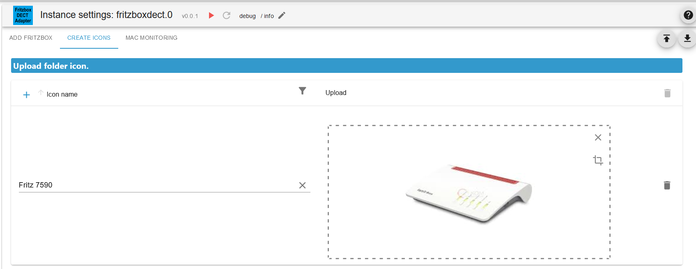
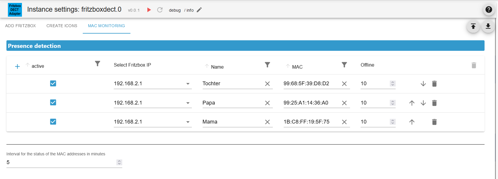
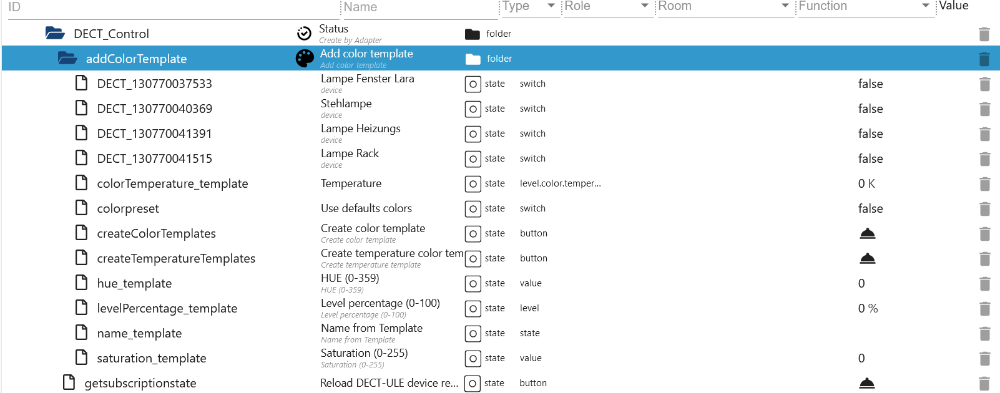
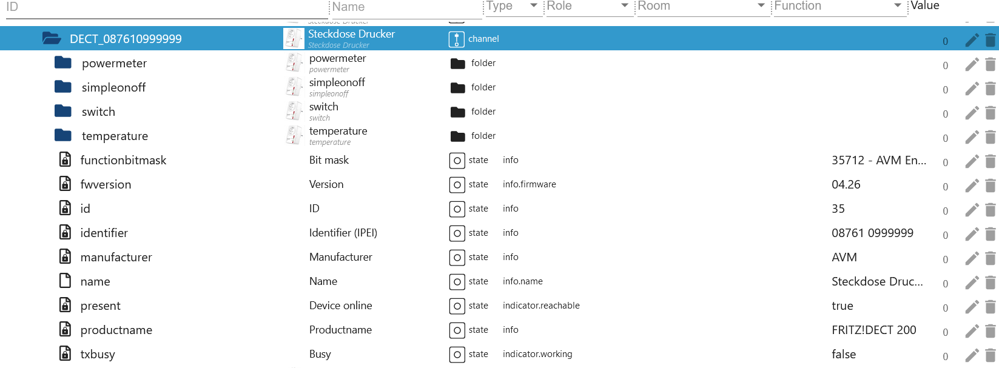
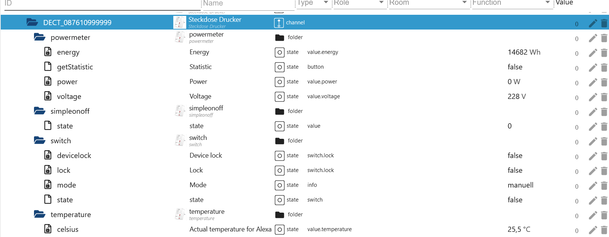
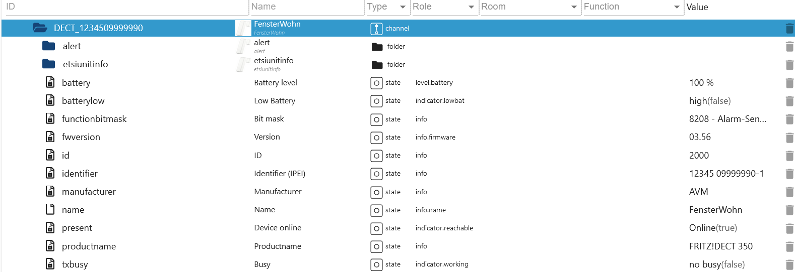
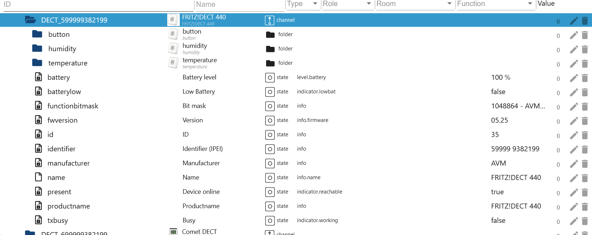

# ioBroker.fritzboxdect

[Zurück zur README](/README.md)

# Setup

-   To activate the call monitor on FRITZ!Box, dial #96*5* from any phone connected to it.

# Summary

-   [Instance Settings](#instance-settings)
    -   [TAB Fritzbox settings](#create-fritzbox)
    -   [TAB Symbole settings](#create-symbole)
    -   [TAB MAC Monitoring settings](#create-mac-monitoring)
-   [Remote control](#remote)
-   [Devices](#dect-devices)
    -   [States readonly](#readonly-states)
    -   [DECT 100](#dect-100)
    -   [DECT 200 und 210](#dect-200---210)
    -   [DECT 300, 301, 302 und Comet](#dect-300-301-302-und-comet)
    -   [DECT 350](#dect-350)
    -   [DECT 400](#dect-400)
    -   [DECT 440](#dect-440)
    -   [DECT 500](#dect-500)
    -   [DECT 546E](#dect-546e)
    -   [DECT Comet](#dect-comet)
    -   [HAN-FUN Rollotron 1213](#han-fun-1213)
    -   [HAN-FUN contact](#han-fun-contact)
    -   [Goups](#groups)
    -   [Template](#templates)
    -   [Trigger](#triggers)
-   [TR-064 Protocol](#tr-064-protocol)
    -   [Call monitoring](#call-monitoring)
    -   [Call list](#call-list)
    -   [Phonebooks](#phonebooks)
    -   [Absence-detection](#absence-detection)
    -   [Commandos and Infos](#commandos-and-infos)
    -   [Blockly](#blockly)

# Instance Settings

### Create Fritzbox

[Summary](#summary)

-   `Active` Fritzbox activate/deactivate
-   `Name` Name
-   `Fritzbox IP` IP Fritzbox
-   `Username` Login Username
-   `Password` Password
-   `Protocol` HTTP od HTTPS
-   `Choose icon` The icon is displayed under Objects. Must first be created under `Choose icon`


-   `Booster` Time to be used with hkr.boostactive (thermostats - in minutes)
-   `Open window` Time to be used for hkr.windowopenactiv (thermostats - in minutes)
-   `DECT interval` Interval for updating DECT and groups. The more devices there are, the longer the update takes and then 1 second doesn't make sense. If the adapter requires longer than the interval, the update is skipped.
-   `Template interval` Interval for updating templates and triggers. Can be deactivated with 0.
-   `Callmonitoring` Activate absence detection
-   `Call log` Number of callers as JSON (absence detection must be activated)
-   `Phonebook` Download all telephone bucks (absence detection must be activated)
-   `TR interval` TR-064 Update interval


### Create symbole

-   `Symbolname` Name of the image. Can then be selected under `ADD Fritzbox`.
-   `Upload` Upload icon




### Create mac monitoring

-   `Active` Absence detection activate/deactivate
-   `Select Fritzbox IP` IP of the created Fritzbox
-   `Name` Name
-   `MAC` MAC address
-   `Offline` Time that a phone must be offline to be set as offline

-   `Interval for the status of the MAC addresses in minutes` Interval for the status of the MAC addresses in minutes



[Summary](#summary)

# Remote

-   States that can be set

    -   `DECT_Control.addColorTemplate`: Create Color Template
        -   `addColorTemplate.createColorTemplates`: Creates a color template
            -   `addColorTemplate.hue_template`: Hue-Value [Please refer JSON](#color-json-dect-500)
            -   `addColorTemplate.saturation_template`: Saturation-value [Please refer JSON](#color-json-dect-500)
        -   `addColorTemplate.createTemperatureTemplates`: Creates a color temperature template
            -   `addColorTemplate.colorTemperature_template`: Value as Kelvin
                ```
                    2700: "Warm white_1"
                    3000: "Warm white_2"
                    3400: "Warm white_3"
                    3800: "Neutral white_1"
                    4200: "Neutral white_2"
                    4700: "Neutral white_3"
                    5300: "Daylight_1"
                    5900: "Daylight_1"
                    6500: "Daylight_1"
                ```
    -   `addColorTemplate.<identifier>`: Which devices should be added to the template (true for add)
    -   `addColorTemplate.colorpreset`: colorpreset==“true” then the color defaults are used, otherwise and in default(false) the color defaults are not used
    -   `addColorTemplate.levelPercentage_template`: Level/level in percent, 0 to 100 percent
    -   `addColorTemplate.name_template`: Name of template
    -   `getsubscriptionstate`: Status DECT-ULE device registration States `subscriptionslatest` and `subscriptionstate` are set
    -   `own_request`: Own request e.g. E.g.: `/webservices/homeautoswitch.lua?switchcmd=getbasicdevicestats&ain=<identifier>` Replace spaces with %20 - URL without `&sid=`
    -   `startulesubscription`: Start DECT-ULE device registration

-   Readonly States
    -   `online` Fritzbox Online yes(true)/no(false)
    -   `sid`: Current session ID
    -   `sid_create` Current session ID created as a timestamp
    -   `subscriptionslatest`: Last registered devices (identifier)
    -   `subscriptionstate`: "0"=login is not running / "1"=login is running / "2"=timeout / "3"=other error

</br>
</br>


[Summary](#summary)

# DECT devices

### Readonly States

-   `functionbitmask`: Bit mask of the device function classes, start with bit 0, several bits can be set
    ```
        Bit 0: HAN-FUN device
        Bit 2: Light/Lamp
        Bit 4: Alarm sensor
        Bit 5: AVM button
        Bit 6: AVM radiator controller
        Bit 7: AVM energy measuring device
        Bit 8: Temperature sensor
        Bit 9: AVM switching socket
        Bit 10: AVM DECT repeater
        Bit 11: AVM microphone
        Bit 13: HAN-FUN unit
        Bit 15: device/socket/lamp/actuator that can be switched on/off
        Bit 16: Device with adjustable dimming, height or level
        Bit 17: Lamp with adjustable color/color temperature
        Bit 18: Roller shutter (blind) - up, down, stop and level 0% to 100%
        Bit 20: Humidity sensor
    ```
-   `fwversion`: Firmware version of the device
-   `id`: Internal device ID
-   `identifier`: Unique ID, AIN, MAC address
-   `manufacturer`: manufacturer
-   `present`: Device connected no/yes
-   `productname`: Product name of the device, empty if unknown/undefined device
-   `txbusy`: Currently sending commands yes(1)/no(0)
-   `etsiunitinfo`: Assignment of HAN-FUN devices
    -   `etsideviceid`: Internal device ID
    -   `interfaces`: HAN-FUN interfaces
    ```
        277 = KEEP_ALIVE
        256 = ALERT
        512 = ON_OFF
        513 = LEVEL_CTRL
        514 = COLOR_CTRL
        516 = OPEN_CLOSE
        517 = OPEN_CLOSE_CONFIG
        772 = SIMPLE_BUTTON
        1024 = SUOTA-Update
    ```
    -   `unittype`: HAN-FUN Unit Typ
    ```
        273 = SIMPLE_BUTTON
        256 = SIMPLE_ON_OFF_SWITCHABLE
        257 = SIMPLE_ON_OFF_SWITCH
        262 = AC_OUTLET
        263 = AC_OUTLET_SIMPLE_POWER_METERING
        264 = SIMPLE_LIGHT
        265 = DIMMABLE_LIGHT
        266 = DIMMER_SWITCH
        277 = COLOR_BULB
        278 = DIMMABLE_COLOR_BULB
        281 = BLIND
        282 = LAMELLAR
        512 = SIMPLE_DETECTOR
        513 = DOOR_OPEN_CLOSE_DETECTOR
        514 = WINDOW_OPEN_CLOSE_DETECTOR
        515 = MOTION_DETECTOR
        518 = FLOOD_DETECTOR
        519 = GLAS_BREAK_DETECTOR
        520 = VIBRATION_DETECTOR
        640 = SIREN
    ```

### DECT 100

[Summary](#summary)

-   States that can be set

    -   `name`: Change name of actor

-   States that can be set if temperature available

    -   `temperature.getTemperatureStatistic`: Loads the temperature statistics (new object devicestats is created) [Please refer](#temperature-statistic)


### DECT 200 - 210

[Summary](#summary)

-   States that can be set

    -   `powermeter.getStatistic`: Loads the power statistics (new devicestats object is created) [Please refer](#power-statistic)
    -   `simpleonoff.state`: 0=off 1=on 2=toggle
    -   `switch.state`: Aktor on/off
    -   `temperature.getTemperatureStatistic`: Loads the temperature statistics (new object devicestats is created) [Please refer](#temperature-statistic)
    -   `name`: Change name of actor

-   Readonly States
    -   `powermeter.energy`: Value in 1.0 Wh (absolute consumption since commissioning)
    -   `powermeter.power`: Value in 1 W (current power, updated approximately every 2 minutes)
    -   `powermeter.voltage`: Value in 1 V (current voltage, updated approximately every 2 minutes)
    -   `switch.devicelock`: false/true - Switch lock on directly on the device no/yes
    -   `switch.lock`: Switch lock via UI/API on no/yes
    -   `switch.mode`: "auto" or "manual" -> automatic timer or switch manually (empty if unknown or error)
    -   `temperature.celsius`: Value in 0.1 °C, negative and positive values ​​possible
    -   `temperature.offset`: Value in 0.1 °C, negative and positive values ​​possible

</br>


### DECT 300, 301, 302 und Comet

[Summary](#summary)

-   Datenpunkte die gesetzt werden können

    -   `hkr.boostactive`: Activate booster heating - time is taken from the instance config
    -   `hkr.boostactiveendtime`: Activate booster heating - Enter booster time in minutes and not greater than 24 hours
    -   `hkr.windowopenactiv`: Activate window open mode - time is taken from the config
    -   `hkr.windowopenactiveendtime`: Enter time for window open mode in minutes and not greater than 24 hours
    -   `hkr.tsoll`: Thermostat setting - 8 to 28°C - 0=auto, 1=closed, 2=open - 254(open)/253(closed)
    -   `temperature.getTemperatureStatistic`: Loads the temperature statistics (new devicestats object is created) [Please refer](#temperature-statistic)
    -   `name`: Change the name of the actuator

-   Readonly States
    -   `hkr.nextchange.endperiod`: Timestamp in seconds since 1970, 0 if unknown
    -   `hkr.nextchange.tchange`: Target temperature, value range see tsoll(255/0xff is unknown/undefined)
    -   `hkr.absenk`: lowering temperature in 0.5 °C (8 to 28°C or 254 = ON, 253 = OFF)
    -   `hkr.adaptiveHeatingActive`: Adaptive heating control activated
    -   `hkr.adaptiveHeatingRunning`: false or true, the adaptive heating control is currently heating
    -   `hkr.battery`: Battery charge level in percent
    -   `hkr.batterylow`: false or true: battery charge level low - please change battery
    -   `hkr.devicelock`: false/true - switch lock on directly on the device no/yes
    -   `hkr.errorcode`: Error codes that the HKR provides (e.g. if there was a problem when installing the HKR)
    ```
        0: no error
        1: No adaptation possible. Device correctly installed on the radiator?
        2: Valve lift too short or battery power too weak. Open and close the valve tappet several times by hand or
        insert new batteries.
        3: No valve movement possible. Valve tappet free?
        4: Installation is currently being prepared.
        5: The radiator controller is in installation mode and can be mounted on the heating valve.
        6: The radiator controller now adapts to the stroke of the heating valve.
    ```
    -   `hkr.holidayactive`: If the HKR is currently in a holiday period, false or true
    -   `hkr.comfort`: Comfort temperature in 0.5 °C (8 to 28°C or 254 = ON, 253 = OFF)
    -   `hkr.lock`: Switch lock via UI/API on no/yes
    -   `hkr.summeractive`: Is the HKR currently in the “heating off” period, false or true
    -   `hkr.tist`: Actual temperature in 0.5 °C, value range 0 to 32°C
    -   `temperature.celsius`: Current temperature in 0.5 °C, value range 0 to 32°C
    -   `temperature.offset`: Value in 0.1 °C, negative and positive values ​​possible
    -   `battery`: Battery charge level in percent
    -   `batterylow`: false or true: battery charge level low - please change battery

</br>
</br>


### DECT 350

[Summary](#summary)

-   States that can be set

    -   `name`: Change the name of the actuator

-   Readonly States
    -   `alert.lastalertchgtimestamp`: Time of last alarm state change
    -   `alert.state`: open(1)/closed(2)
    -   `etsiunitinfo`: [Please refer](#readonly-states)
    -   `battery`: Battery charge level in percent
    -   `batterylow`: false or true: battery charge level low - please change battery

</br>


### DECT 400

[Summary](#summary)

-   States that can be set

    -   `name`: Change the name of the actuator
    -   `button.<identifier>.name`: Change the name of the button

-   Readonly States
    -   `button.<identifier>.id`: Internal device ID
    -   `button.<identifier>.identifier`:Unique ID, AIN
    -   `button.<identifier>.lastpressedtimestamp`: time of last button press, timestamp in seconds since 1970, 0 or empty if unknown
    -   `battery`: Battery charge level in percent
    -   `batterylow`: false or true: battery charge level low - please change battery

</br>


### DECT 440

[Summary](#summary)

-   States that can be set

    -   `name`: Change the name of the actuator
    -   `button.<identifier>.name`: Change the name of the button
    -   `temperature.getTemperatureStatistic`: Loads the temperature statistics (new object devicestats is created) [Please refer](#temperature-statistic)

-   Readonly States
    -   `button.<identifier>.id`: Internal device ID
    -   `button.<identifier>.identifier`:Unique ID, AIN
    -   `button.<identifier>.lastpressedtimestamp`: time of last button press, timestamp in seconds since 1970, 0 or empty if unknown
    -   `humidity.rel_humidity`: Humidity in percent from 0 to 100, special value: -9999 if unknown
    -   `temperature.celsius`: Current temperature in 0.5 °C, value range 0 to 32°C
    -   `temperature.offset`: Value in 0.1 °C, negative and positive values ​​possible
    -   `battery`: Battery charge level in percent
    -   `batterylow`: false or true: battery charge level low - please change battery

</br>
</br>


### DECT 500

[Summary](#summary)

-   States that can be set

    -   `colorcontrol.getColor`: Loads the possible colors (new object devicecolor is created) [Please refer](#color-palette)
    -   `colorcontrol.hex`: color selection as hex and # prefix e.g. Example: #5eff5e
    -   `colorcontrol.hue`: Hue value (0° to 359° - `colorcontrol.current_mode` must have 1) - Attention!! First set saturation and then hue. The trigger is at hue and saturation is read out.
    -   `colorcontrol.saturation`: See `colorcontrol.hue`
    -   `colorcontrol.temperature`: Value in Kelvin, a typical value range is from around 2700° to 6500°

    ```
        "-1": "Off"
        2700: "Warm white_1"
        3000: "Warm white_2"
        3400: "Warm white_3"
        3800: "Neutral white_1"
        4200: "Neutral white_2"
        4700: "Neutral white_3"
        5300: "Daylight_1"
        5900: "Daylight_1"
        6500: "Daylight_1"
    ```

    -   `colorcontrol.unmapped_hue`: The Hue value corrected via the color defaults (0° to 359° - `colorcontrol.mapped` must have Attention!! First set saturation and then hue. The trigger is at hue and saturation is read out.
    -   `colorcontrol.unmapped_saturation`: See `colorcontrol.unmapped_hue`
    -   `levelcontrol.level`: Level from 0(0%) to 255(100%)
    -   `levelcontrol.levelpercentage`: Level in percent, 0 to 100 percent
    -   `simpleonoff.state`: 0=off 1=on 2=toggle
    -   `simpleonoff.simpleonoff`: Actor on(true)/off(false)
    -   `name`: Change the name of the actuator`:

-   Possible Hue and Saturation values

### Color JSON DECT 500

```JSON
{
    "red"       : {"hue" : 358, "sat" : [180,112,54], "val" : [255,255,255] },
    "orange"    : {"hue" : 35,  "sat" : [214,140,72], "val" : [252,252,255] },
    "yellow"    : {"hue" : 52,  "sat" : [153,102,51], "val" : [255,255,255] },
    "lime"      : {"hue" : 92,  "sat" : [123, 79,38], "val" : [248,250,252] },
    "green"     : {"hue" : 120, "sat" : [160, 82,38], "val" : [220,232,242] },
    "turquoise" : {"hue" : 160, "sat" : [145, 84,41], "val" : [235,242,248] },
    "cyan"      : {"hue" : 195, "sat" : [179,118,59], "val" : [255,255,255] },
    "lightblue" : {"hue" : 212, "sat" : [169,110,56], "val" : [252,252,255] },
    "blue"      : {"hue" : 225, "sat" : [204,135,67], "val" : [255,255,255] },
    "purple"    : {"hue" : 266, "sat" : [169,110,54], "val" : [250,250,252] },
    "magenta"   : {"hue" : 296, "sat" : [140, 92,46], "val" : [250,252,255] },
    "pink"      : {"hue" : 335, "sat" : [180,107,51], "val" : [255,248,250] }
}
```

-   Readonly States

    -   `colorcontrol.current_mode`: 1(HueSaturation), 4 (color temperature) or ""(empty → unknown)
    -   `colorcontrol.fullcolorsupport`: Lamp supports setunmappedcolor, i.e. colors that differ from the colordefaults
        HueSaturation values ​​yes(true)/no(false)
    -   `colorcontrol.mapped`: false or true, false: assigned HueSaturation value set differently from the color defaults, true:
        Colordefaults value set
    -   `colorcontrol.supported_modes`: 2 = HueSaturation-Mode, 5 = Colortemperatur-Mode
    -   `etsiunitinfo`: [Please refer](#readonly-states)

</br>
</br>


### DECT 546E

[Summary](#summary)

-   States that can be set

    -   `powermeter.getStatistic`: Loads the power statistics (new object devicestats is created) [Please refer](#power-statistic)
    -   `simpleonoff.state`: 0=off 1=on 2=toggle
    -   `switch.state`: Actuator on/off
    -   `temperature.getTemperatureStatistic`: Loads the temperature statistics (new devicestats object is created) [Please refer](#temperature-statistic)
    -   `name`: Change the name of the actuator

-   Readonly States
    -   `powermeter.energy`: Value in 1.0 Wh (absolute consumption since commissioning)
    -   `powermeter.power`: Value in 1 W (current power, updated approximately every 2 minutes)
    -   `powermeter.voltage`: Value in 1 V (current voltage, updated approximately every 2 minutes)
    -   `switch.devicelock`: false/true - Switch lock on directly on the device no/yes
    -   `switch.lock`: Switch lock via UI/API on no/yes
    -   `switch.mode`: "auto" or "manual" -> automatic timer or switch manually (empty if unknown or error)

</br>


### HAN-FUN 1213

[Summary](#summary)

-   States that can be set

    -   `levelcontrol.blindclose`: Close roller shutter (state for Alexa)
    -   `levelcontrol.blindlevel`: roller shutter level 0%-100% (state for Alexa)
    -   `levelcontrol.blindopen`: Open roller shutter (state for Alexa)
    -   `levelcontrol.blindstop`: stop roller shutter running (state for Alexa)
    -   `levelcontrol.blindvalue`: roller shutter level status 0%-100% (state for Alexa)
    -   `levelcontrol.level`: Level from 0(0%) to 255(100%)
    -   `levelcontrol.levelpercentage`: Level in percent, 0 to 100 percent
    -   `name`: Change the name of the actuator

-   Readonly States
    -   `alert.lastalertchgtimestamp`: Time of last alarm state change
    -   `alert.state`: No error(0)/Obstacle alarm(1)/Overheat alarm(2)
    -   `blind.endpositionsset`: End position configured for the blind? empty: unknown, 0: not configured, 1: configured
    -   `blind.mode`: "auto" or "manual" -> automatic timer or drive manually (empty if unknown or error)
    -   `etsiunitinfo`: [Please refer](#readonly-states)

</br>
</br>


### HAN-FUN contact

[Summary](#summary)

-   States that can be set

    -   `name`: Change the name of the actuator

-   Readonly States
    -   `alert.lastalertchgtimestamp`: Time of last alarm state change
    -   `alert.state`: open(1)/closed(2)
    -   `etsiunitinfo`: [Please refer](#readonly-states)

</br>


# Groups

[Summary](#summary)

-   States that can be set

    -   `name`: Change the name of the actuator
    -   All states of the actors that were added to the group


# Templates

[Summary](#summary)

-   States that can be set

    -   `metadata.icon`: ID of the icon for the appropriate icon font (possible icons unknown)
    -   `metadata.type`: Defined only for scenarios: Type of the scenarios. A string of "coming", "leaving" or "generic" (generic for free scenarios)
    -   `metadata.setMetadata`: Send values ​​`metadata.icon` and `metadata.type` to Fritzbox - `apply`: Apply template - `name`: Change name of actor

-   Readonly States
    -   `applymask`: Possible configuration
        -   <hkr_summer> //HKR heating off switch (in summer)
        -   <hkr_temperature> //HKR target temperature
        -   <hkr_holidays> //HKR holiday switching
        -   <hkr_time_table> //HKR time switch
        -   <relay_manual> //switchable socket/lamp/actuator ON/OFF
        -   <relay_automatic> //switchable socket/lamp/roller shutter timer switch
        -   <level> //Level or brightness of lamp/roller shutter
        -   <color> //color or color temperature
        -   <dialhelper> //call announcement
        -   <sun_simulation> //Light sunrise and sunset simulation
        -   <subs_templates> //grouped templates, scenarios
        -   <main_wifi> //WLAN on/off
        -   <guest_wifi> //Guest WiFi on/off
        -   <tam_control> //Answering machine on/off
        -   <http_request> //send any HTTP request
        -   <timer_control> //Activate HKR boost/window open/temperature override
        -   <switch_master> //Switch devices to the state of other devices
        -   <custom_notification> //Trigger pushmail/app notification
    -   `autocreate`: templates and scenarios created automatically yes(true)/no(false)
    -   `devices` Device assigned to the template (identifier as an array)
    -   `mask`: Unknown! Seems to be bit?!
    -   `sub_templates` sub-templates assigned to the template (identifier as an array)
    -   `triggers`: Routines/triggers assigned to the template (identifier as an array)


# Triggers

[Summary](#summary)

-   States that can be set

    -   `active`: false/true flag, trigger activated(true) or deactivated(false)
    -   `name`: Change the name of the actuator


### Power Statistic

[Summary](#summary)

-   `devicestatistic.<energy|power|voltage>.chart`: Array_JSON with time and value
-   `devicestatistic.<energy|power|voltage>.count`: Number of values
-   `devicestatistic.<energy|power|voltage>.datatime`: Attribute contains the Unix timestamp of the last update
-   `devicestatistic.<energy|power|voltage>.grid`: Time distance/resolution in seconds
-   `devicestatistic.<energy|power|voltage>.value`: The content is a count number of comma separated list of values. Values ​​with “-” are unknown

</br>
</br>


### Temperature Statistic

[Summary](#summary)

-   `devicestatistic.<energy|power|voltage>.chart`: Array_JSON with time and value
-   `devicestatistic.temperature.count`: Number of values
-   `devicestatistic.temperature.datatime`: Attribute contains the Unix timestamp of the last update
-   `devicestatistic.temperature.grid`: Time distance/resolution in seconds
-   `devicestatistic.temperature.value`: The content is a count number of comma separated list of values. Values ​​with “-” are unknown


### Color palette

[Summary](#summary)

</br>
</br>


### TR-064 Protocol

[Summary](#summary)


# Call monitoring

[Summary](#summary)

-   `Calllists.incomming` incoming callers
-   `Calllists.missed` missed calls
-   `Calllists.outgoing` outgoing calls
    -   `Calllists.incomming.count` Total calls
    -   `Calllists.incomming.json` Calls as JSON - number adjustable in the instance

```JSON
[
  {
    "id": "2381",
    "type": "1",
    "caller": "0111111111",
    "called": "SIP: 12121212",
    "callednumber": "12121212",
    "name": "Eltern",
    "numbertype": "sip",
    "device": "Kitchen",
    "port": "10",
    "date": "28.05.24 17:50",
    "duration": "0:01",
    "count": "",
    "path": "",
    "prefix": "02222",
    "state": "Muster",
    "sym": ">"
  }
]
```


# Call list

[Summary](#summary)

-   `Callmonitor.connect` current phone call
-   `Callmonitor.inbound` incoming call
-   `Callmonitor.lastcall` last call
-   `Callmonitor.outbound` outgoing call
    -   `Callmonitor.connect.called` called
    -   `Callmonitor.connect.calledname` Called name
    -   `Callmonitor.connect.caller` caller
    -   `Callmonitor.connect.callername` Caller name
    -   `Callmonitor.connect.extension` Extension
    -   `Callmonitor.connect.id` ID
    -   `Callmonitor.connect.json` JSON (see below)
    -   `Callmonitor.connect.sip` SIP
    -   `Callmonitor.connect.timestamp` timestamp
    -   `Callmonitor.connect.type` Type
-   `Callmonitor.calldata` JSON last action
-   `Callmonitor.status` Status of the monitoring

```JSON
{
  "lastrawdata": "08.06.24 11:26:36;DISCONNECT;1;0;",
  "rawdata": [
    "08.06.24 11:26:29;CALL;1;10;8xxxxxx;01xxxxxxxxx;SIP0;",
    "08.06.24 11:26:36;DISCONNECT;1;0;"
  ],
  "date": "2024-06-08T09:26:36.759Z",
  "id": 1,
  "timestamp": 1717838796759,
  "kind": "HangUp",
  "extension": 10,
  "caller": "8xxxxxx",
  "callername": "All (Phonebook Name)",
  "called": "01xxxxxxxxx",
  "calledname": "Handy (Phonebook Name)",
  "pickup": "",
  "sip": "SIP0",
  "duration": 0,
  "type": "CALL",
  "prefix": "01xx",
  "state": "Muster"
}
```


# Phonebooks

[Summary](#summary)

-   `Phonebooks.phonebook_x` Phonebook as JSON

```JSON
[
  {
    "category": "0",
    "realname": "Alle (Rundruf)",
    "uniqueid": "5",
    "email": "",
    "number": "**9",
    "imageURL": ""
  },
  {
    "category": "0",
    "realname": "Max Mustermann",
    "uniqueid": "15",
    "email": "",
    "number": "+11111111",
    "imageURL": ""
  },
]
```


# Absence detection

[Summary](#summary)

-   `currentoffline` devices offline. If the value is higher than the value in the instance setting, the device is set offline and here 0.
-   `currentonline` Geräte online in minutes.
-   `ip` IP from device
-   `json` All states as JSON
-   `lastoffline` offline for the last time
-   `lastonline` online for the last time
-   `mac` MAC address
-   `name` Name of the device (from the Fritzbox)
-   `namefritz` Name of the device (from the instance setting)
-   `status` Status true=online/false=offline

```JSON
{
  "ip": "192.168.2.1",
  "mac": "1B:C9:FF:11:5F:26",
  "mac_object": "1B_C9_FF_11_5F_26",
  "name": "Papa",
  "online_time": 1715524156000,
  "online_utc": "12.05.2024 16:29:16",
  "online_minutes": 28793,
  "online_text": "19 days, 23 hours, 52 minutes",
  "offline_time": 0,
  "offline_utc": "",
  "offline_time_temp": 0,
  "offline_minutes": 0,
  "offline_text": "",
  "active": true,
  "off_time": 600000,
  "last_check": 1717251734725,
  "name_fritz": "Handy-S20",
  "ip_fritz": "192.168.2.47",
  "interface_fritz": "802.11",
  "source_fritz": "DHCP",
  "remaining_fritz": 0,
  "active_fritz": 1
}
```


# Commandos and Infos

[Summary](#summary)

-   `States.downstream` Downstream in bits
-   `States.error` error message
-   `States.externalIPv4` IP4
-   `States.externalIPv6` IP6
-   `States.externalIPv6Prefix` IP6 prefix
-   `States.firmware` current firmware
-   `States.hardware` hardware
-   `States.lastupdate` last update
-   `States.mac` MAC address
-   `States.protocol` log entries as JSON
-   `States.response` Response from command (States.sendCommand) as JSON
-   `States.responseXML` Response from command (States.sendCommand) as XML
-   `States.sendCommand` send command (see below)
-   `States.sendCommandPossible` All services as JSON
-   `States.serialnumber` serial number
-   `States.status` Status of the Fritzbox
-   `States.upstream` Upstream in bits
-   `States.uptime` how long online
-   `States.wlan24` Wifi 2,4 GHz on/off
-   `States.wlan50` Wifi GHz on/off
-   `States.wlanguest` Wifi guest access on/off
-   `States.wlanguestname` Change SSID of guest access

# Log entries as JSON

```JSON
[
  {
    "0": "29.05.24 08:03:39 Information des Anbieters über die Geschwindigkeit des Internetzugangs (verfügbare Bitrate): 264608/46440 kbit/s"
  },
]
```

# Example command for switching on answering machine

```JSON
{
    "service": "urn:dslforum-org:service:X_AVM-DE_TAM:1",
    "action": "SetEnable",
    "params": {
        "NewIndex": "0",
        "NewEnable": "1"
    },
    "html": false, // true for converting HTML entities into plain text (&amp; -> &)
    "tag": "", // Enter the tag name of the link here (link must remain empty) -> Example call list or see also Blockly
    "link": "", // Query and edit link - Then enter it here (tag must remain empty) -> Example call list or see also Blockly
}
```

# Load messages

```JSON
{
    "service": "urn:dslforum-org:service:X_AVM-DE_TAM:1",
    "action": "GetMessageList",
    "params": {},
    "html": true, // true for replace in XML -> &amp; = &
    "tag": "",
    "link": "",
}
```

# Response

```JSON
 <?xml version="1.0"?>
    <s:Envelope xmlns:s="http://schemas.xmlsoap.org/soap/envelope/" s:encodingStyle="http://schemas.xmlsoap.org/soap/encoding/"> <s:Body>
        <u:GetMessageListResponse xmlns:u="urn:dslforum-org:service:X_AVM-DE_TAM:1">
            <NewURL>http://192.168.2.1:49000/tamcalllist.lua?sid=4f4ac54ac29b9a14&amp;tamindex=0</NewURL> // TAG = NewURL
        </u:GetMessageListResponse>
    </s:Body>
</s:Envelope>

{
  "s:envelope": {
    "s:body": {
      "u:getmessagelistresponse": {
        "newurl": "http://192.168.2.1:49000/tamcalllist.lua?sid=d2b0b88ba85b790b&tamindex=0"
      }
    }
  }
}
```

# Load messages with link

```JSON
{
    "service": "urn:dslforum-org:service:X_AVM-DE_TAM:1",
    "action": "GetMessageList",
    "params": {},
    "html": true, // true for replace in XML -> &amp; = &
    "tag": "", // Must then remain empty
    "link": "http://192.168.2.1:49000/tamcalllist.lua?sid=d2b0b88ba85b790b&tamindex=0",
}
```

# Load messages with TAG immediately

```JSON
{
    "service": "urn:dslforum-org:service:X_AVM-DE_TAM:1",
    "action": "GetMessageList",
    "params": {},
    "html": true, // true for replace in XML -> &amp; = &
    "tag": "NewURL",
    "link": "", // Must then remain empty
}
```

</br>


# Traffic Monitoring

-   `States.Traffic.accesstype`Access group
-   `States.Traffic.download` Max number of bytes per second in downstream direction
-   `States.Traffic.fritz_monitor` Value Fritzbox -> Internet -> Online-Monitor
-   `States.Traffic.fritz_monitor_update` Update `States.Traffic.fritz_monitor`
-   `States.Traffic.gettotalByteReceive` Get total byte receive
-   `States.Traffic.gettotalByteSent` Get total byte sent
-   `States.Traffic.gettotalPacketsReceive` Get total packets receive
-   `States.Traffic.gettotalPacketsSent` Get total packets sent
-   `States.Traffic.groupmode` Name of sync group
-   `States.Traffic.newds_current_bps` Current number of bytes per second in downstream direction of multicast traffic
-   `States.Traffic.newmc_current_bps` Current number of bytes per second in downstream direction of home, guest and multicast traffic
-   `States.Traffic.newprio_default_bps` Current number of bytes per second in upstream direction of default home traffic
-   `States.Traffic.newprio_high_bps` Current number of bytes per second in upstream direction of important home traffic
-   `States.Traffic.newprio_low_bps` Current number of bytes per second in upstream direction of background home traffic
-   `States.Traffic.newprio_realtime_bps` Current number of bytes per second in upstream direction of real-time home traffic
-   `States.Traffic.newus_current_bps` Current number of bytes per second in upstream direction
-   `States.Traffic.upload` Max number of bytes per second in upstream direction

# Online Monitoring

```JSON
{
  "LastMonth": {
    "name": "Vormonat",
    "time": "743:59",
    "outgoing": 40321,
    "incoming": 812748,
    "total": 853069,
    "connection": "62"
  },
  "ThisWeek": {
    "name": "Aktuelle Woche",
    "time": "6:21",
    "outgoing": 123,
    "incoming": 911,
    "total": 1034,
    "connection": "2"
  },
  "Today": {
    "name": "Heute",
    "time": "6:21",
    "outgoing": 123,
    "incoming": 911,
    "total": 1034,
    "connection": "2"
  },
  "Yesterday": {
    "name": "Gestern",
    "time": "24:00",
    "outgoing": 1605,
    "incoming": 45867,
    "total": 47472,
    "connection": "2"
  },
  "ThisMonth": {
    "name": "Aktueller Monat",
    "time": "222:20",
    "outgoing": 15394,
    "incoming": 239237,
    "total": 254631,
    "connection": "22"
  }
}
```


# Energy Monitoring

-   `States.Energy.conn_currently` Current connection
-   `States.Energy.conn_last24h` Connection of the last 24 hours
-   `States.Energy.cpu_temperature` CPU temperature for echart
-   `States.Energy.cpu_usage` CPU load for echart
-   `States.Energy.cpu_usage_scale` Scaling (hours) for CPU load and temperature for echart
-   `States.Energy.fon_currently` Current phone connections
-   `States.Energy.fon_last24h` Phone connections of the last 24 hours
-   `States.Energy.lan1` Lan 1 active/inactive
-   `States.Energy.lan2` Lan 2 active/inactive
-   `States.Energy.lan3` Lan 3 active/inactive
-   `States.Energy.lan4` Lan 4 active/inactive
-   `States.Energy.main_currently` Main processor current
-   `States.Energy.main_last24h` Main processor of the last 24 hours
-   `States.Energy.ram_usage` RAM usage for echart
-   `States.Energy.ram_usage_scale` Scaling (hours) RAM usage for echart
-   `States.Energy.total_currently` Total current
-   `States.Energy.total_last24h` Total of the last 24 hours
-   `States.Energy.usb_currently` USB devices current
-   `States.Energy.usb_last24h` USB devices of the last 24 hours
-   `States.Energy.wan` WAN active/inactive
-   `States.Energy.wifi_currently` WLAN current
-   `States.Energy.wifi_last24h` WLAN of the last 24 hours

</br>


### Blockly

[Summary](#summary)

-   As an example, load messages from the answering machine where this is ller.
-   All responses are also written in `States.response` and `States.responseXML`

```JSON
{
    "service": "urn:dslforum-org:service:X_AVM-DE_TAM:1", -> SERVICE-ID
    "action": "GetMessageList", -> Action
    "params": {
      "NewIndex": "0", -> Parameter 1 + Value 1 // 0 für Anfrufbeantworter 1 oder 1 für Anrufbeantworter 2
    },
    "html": true, -> HTML convert
    "tag": "", -> HTML TAG
    "link": "", -> Link
}
```


-   Links can be read in order to edit them further. Can be used in the call list to add even more attributes (example &days=2 or &max=20). The sid does not need to be replaced!!!


-   If the TAG is known, the list can be loaded immediately.


-   Load info from an IP

```JSON
{
    "service": "urn:dslforum-org:service:Hosts:1",
    "action": "X_AVM-DE_GetSpecificHostEntryByIp",
    "params": {
      "NewIPAddress": "192.168.2.18",
    },
    "html": true,
    "tag": "",
    "link": "",
}
```


-   Load Mesh-Topologie

```JSON
{
    "service": "urn:dslforum-org:service:Hosts:1",
    "action": "X_AVM-DE_GetMeshListPath",
    "params": {},
    "html": true,
    "tag": "NewX_AVM-DE_MeshListPath",
    "link": "",
}
```

</br>


-   Of course, all commands can also be issued with Javascript.

```JAVA
var data = {
    "ip":"192.168.2.1",
    "service":"urn:dslforum-org:service:X_AVM-DE_TAM:1",
    "action":"GetMessageList",
    "param_1":"NewIndex",
    "val_1":"0",
    "param_2":"",
    "val_2":"",
    "link":"",
    "tag":"NewURL",
    "html":true
}
sendTo('fritzboxdect.0', 'getTRRequest', data, function (result) {
    if (result.error) {
        console.error(result.error);
    } else {
        console.log("Result: " + JSON.stringify(result));
    }
});
```


[Summary](#summary)

# Services

```JSON
[
  {
    "servicetype": "urn:dslforum-org:service:DeviceInfo:1",
    "serviceid": "urn:DeviceInfo-com:serviceId:DeviceInfo1",
    "controlurl": "/upnp/control/deviceinfo",
    "eventsuburl": "/upnp/control/deviceinfo",
    "scpdurl": "/deviceinfoSCPD.xml"
  },
  {
    "servicetype": "urn:dslforum-org:service:DeviceConfig:1",
    "serviceid": "urn:DeviceConfig-com:serviceId:DeviceConfig1",
    "controlurl": "/upnp/control/deviceconfig",
    "eventsuburl": "/upnp/control/deviceconfig",
    "scpdurl": "/deviceconfigSCPD.xml"
  },
  {
    "servicetype": "urn:dslforum-org:service:Layer3Forwarding:1",
    "serviceid": "urn:Layer3Forwarding-com:serviceId:Layer3Forwarding1",
    "controlurl": "/upnp/control/layer3forwarding",
    "eventsuburl": "/upnp/control/layer3forwarding",
    "scpdurl": "/layer3forwardingSCPD.xml"
  },
  {
    "servicetype": "urn:dslforum-org:service:LANConfigSecurity:1",
    "serviceid": "urn:LANConfigSecurity-com:serviceId:LANConfigSecurity1",
    "controlurl": "/upnp/control/lanconfigsecurity",
    "eventsuburl": "/upnp/control/lanconfigsecurity",
    "scpdurl": "/lanconfigsecuritySCPD.xml"
  },
  {
    "servicetype": "urn:dslforum-org:service:ManagementServer:1",
    "serviceid": "urn:ManagementServer-com:serviceId:ManagementServer1",
    "controlurl": "/upnp/control/mgmsrv",
    "eventsuburl": "/upnp/control/mgmsrv",
    "scpdurl": "/mgmsrvSCPD.xml"
  },
  {
    "servicetype": "urn:dslforum-org:service:Time:1",
    "serviceid": "urn:Time-com:serviceId:Time1",
    "controlurl": "/upnp/control/time",
    "eventsuburl": "/upnp/control/time",
    "scpdurl": "/timeSCPD.xml"
  },
  {
    "servicetype": "urn:dslforum-org:service:UserInterface:1",
    "serviceid": "urn:UserInterface-com:serviceId:UserInterface1",
    "controlurl": "/upnp/control/userif",
    "eventsuburl": "/upnp/control/userif",
    "scpdurl": "/userifSCPD.xml"
  },
  {
    "servicetype": "urn:dslforum-org:service:X_AVM-DE_Storage:1",
    "serviceid": "urn:X_AVM-DE_Storage-com:serviceId:X_AVM-DE_Storage1",
    "controlurl": "/upnp/control/x_storage",
    "eventsuburl": "/upnp/control/x_storage",
    "scpdurl": "/x_storageSCPD.xml"
  },
  {
    "servicetype": "urn:dslforum-org:service:X_AVM-DE_WebDAVClient:1",
    "serviceid": "urn:X_AVM-DE_WebDAV-com:serviceId:X_AVM-DE_WebDAVClient1",
    "controlurl": "/upnp/control/x_webdav",
    "eventsuburl": "/upnp/control/x_webdav",
    "scpdurl": "/x_webdavSCPD.xml"
  },
  {
    "servicetype": "urn:dslforum-org:service:X_AVM-DE_UPnP:1",
    "serviceid": "urn:X_AVM-DE_UPnP-com:serviceId:X_AVM-DE_UPnP1",
    "controlurl": "/upnp/control/x_upnp",
    "eventsuburl": "/upnp/control/x_upnp",
    "scpdurl": "/x_upnpSCPD.xml"
  },
  {
    "servicetype": "urn:dslforum-org:service:X_AVM-DE_Speedtest:1",
    "serviceid": "urn:X_AVM-DE_Speedtest-com:serviceId:X_AVM-DE_Speedtest1",
    "controlurl": "/upnp/control/x_speedtest",
    "eventsuburl": "/upnp/control/x_speedtest",
    "scpdurl": "/x_speedtestSCPD.xml"
  },
  {
    "servicetype": "urn:dslforum-org:service:X_AVM-DE_RemoteAccess:1",
    "serviceid": "urn:X_AVM-DE_RemoteAccess-com:serviceId:X_AVM-DE_RemoteAccess1",
    "controlurl": "/upnp/control/x_remote",
    "eventsuburl": "/upnp/control/x_remote",
    "scpdurl": "/x_remoteSCPD.xml"
  },
  {
    "servicetype": "urn:dslforum-org:service:X_AVM-DE_MyFritz:1",
    "serviceid": "urn:X_AVM-DE_MyFritz-com:serviceId:X_AVM-DE_MyFritz1",
    "controlurl": "/upnp/control/x_myfritz",
    "eventsuburl": "/upnp/control/x_myfritz",
    "scpdurl": "/x_myfritzSCPD.xml"
  },
  {
    "servicetype": "urn:dslforum-org:service:X_VoIP:1",
    "serviceid": "urn:X_VoIP-com:serviceId:X_VoIP1",
    "controlurl": "/upnp/control/x_voip",
    "eventsuburl": "/upnp/control/x_voip",
    "scpdurl": "/x_voipSCPD.xml"
  },
  {
    "servicetype": "urn:dslforum-org:service:X_AVM-DE_OnTel:1",
    "serviceid": "urn:X_AVM-DE_OnTel-com:serviceId:X_AVM-DE_OnTel1",
    "controlurl": "/upnp/control/x_contact",
    "eventsuburl": "/upnp/control/x_contact",
    "scpdurl": "/x_contactSCPD.xml"
  },
  {
    "servicetype": "urn:dslforum-org:service:X_AVM-DE_Dect:1",
    "serviceid": "urn:X_AVM-DE_Dect-com:serviceId:X_AVM-DE_Dect1",
    "controlurl": "/upnp/control/x_dect",
    "eventsuburl": "/upnp/control/x_dect",
    "scpdurl": "/x_dectSCPD.xml"
  },
  {
    "servicetype": "urn:dslforum-org:service:X_AVM-DE_TAM:1",
    "serviceid": "urn:X_AVM-DE_TAM-com:serviceId:X_AVM-DE_TAM1",
    "controlurl": "/upnp/control/x_tam",
    "eventsuburl": "/upnp/control/x_tam",
    "scpdurl": "/x_tamSCPD.xml"
  },
  {
    "servicetype": "urn:dslforum-org:service:X_AVM-DE_AppSetup:1",
    "serviceid": "urn:X_AVM-DE_AppSetup-com:serviceId:X_AVM-DE_AppSetup1",
    "controlurl": "/upnp/control/x_appsetup",
    "eventsuburl": "/upnp/control/x_appsetup",
    "scpdurl": "/x_appsetupSCPD.xml"
  },
  {
    "servicetype": "urn:dslforum-org:service:X_AVM-DE_Homeauto:1",
    "serviceid": "urn:X_AVM-DE_Homeauto-com:serviceId:X_AVM-DE_Homeauto1",
    "controlurl": "/upnp/control/x_homeauto",
    "eventsuburl": "/upnp/control/x_homeauto",
    "scpdurl": "/x_homeautoSCPD.xml"
  },
  {
    "servicetype": "urn:dslforum-org:service:X_AVM-DE_Homeplug:1",
    "serviceid": "urn:X_AVM-DE_Homeplug-com:serviceId:X_AVM-DE_Homeplug1",
    "controlurl": "/upnp/control/x_homeplug",
    "eventsuburl": "/upnp/control/x_homeplug",
    "scpdurl": "/x_homeplugSCPD.xml"
  },
  {
    "servicetype": "urn:dslforum-org:service:X_AVM-DE_Filelinks:1",
    "serviceid": "urn:X_AVM-DE_Filelinks-com:serviceId:X_AVM-DE_Filelinks1",
    "controlurl": "/upnp/control/x_filelinks",
    "eventsuburl": "/upnp/control/x_filelinks",
    "scpdurl": "/x_filelinksSCPD.xml"
  },
  {
    "servicetype": "urn:dslforum-org:service:X_AVM-DE_Auth:1",
    "serviceid": "urn:X_AVM-DE_Auth-com:serviceId:X_AVM-DE_Auth1",
    "controlurl": "/upnp/control/x_auth",
    "eventsuburl": "/upnp/control/x_auth",
    "scpdurl": "/x_authSCPD.xml"
  },
  {
    "servicetype": "urn:dslforum-org:service:X_AVM-DE_HostFilter:1",
    "serviceid": "urn:X_AVM-DE_HostFilter-com:serviceId:X_AVM-DE_HostFilter1",
    "controlurl": "/upnp/control/x_hostfilter",
    "eventsuburl": "/upnp/control/x_hostfilter",
    "scpdurl": "/x_hostfilterSCPD.xml"
  },
  {
    "servicetype": "urn:dslforum-org:service:X_AVM-DE_USPController:1",
    "serviceid": "urn:X_AVM-DE_USPController-com:serviceId:X_AVM-DE_USPController1",
    "controlurl": "/upnp/control/x_uspcontroller",
    "eventsuburl": "/upnp/control/x_uspcontroller",
    "scpdurl": "/x_uspcontrollerSCPD.xml"
  },
  {
    "servicetype": "urn:dslforum-org:service:WLANConfiguration:1",
    "serviceid": "urn:WLANConfiguration-com:serviceId:WLANConfiguration1",
    "controlurl": "/upnp/control/wlanconfig1",
    "eventsuburl": "/upnp/control/wlanconfig1",
    "scpdurl": "/wlanconfigSCPD.xml"
  },
  {
    "servicetype": "urn:dslforum-org:service:WLANConfiguration:2",
    "serviceid": "urn:WLANConfiguration-com:serviceId:WLANConfiguration2",
    "controlurl": "/upnp/control/wlanconfig2",
    "eventsuburl": "/upnp/control/wlanconfig2",
    "scpdurl": "/wlanconfigSCPD.xml"
  },
  {
    "servicetype": "urn:dslforum-org:service:WLANConfiguration:3",
    "serviceid": "urn:WLANConfiguration-com:serviceId:WLANConfiguration3",
    "controlurl": "/upnp/control/wlanconfig3",
    "eventsuburl": "/upnp/control/wlanconfig3",
    "scpdurl": "/wlanconfigSCPD.xml"
  },
  {
    "servicetype": "urn:dslforum-org:service:Hosts:1",
    "serviceid": "urn:LanDeviceHosts-com:serviceId:Hosts1",
    "controlurl": "/upnp/control/hosts",
    "eventsuburl": "/upnp/control/hosts",
    "scpdurl": "/hostsSCPD.xml"
  },
  {
    "servicetype": "urn:dslforum-org:service:LANEthernetInterfaceConfig:1",
    "serviceid": "urn:LANEthernetIfCfg-com:serviceId:LANEthernetInterfaceConfig1",
    "controlurl": "/upnp/control/lanethernetifcfg",
    "eventsuburl": "/upnp/control/lanethernetifcfg",
    "scpdurl": "/ethifconfigSCPD.xml"
  },
  {
    "servicetype": "urn:dslforum-org:service:LANHostConfigManagement:1",
    "serviceid": "urn:LANHCfgMgm-com:serviceId:LANHostConfigManagement1",
    "controlurl": "/upnp/control/lanhostconfigmgm",
    "eventsuburl": "/upnp/control/lanhostconfigmgm",
    "scpdurl": "/lanhostconfigmgmSCPD.xml"
  },
  {
    "servicetype": "urn:dslforum-org:service:WANCommonInterfaceConfig:1",
    "serviceid": "urn:WANCIfConfig-com:serviceId:WANCommonInterfaceConfig1",
    "controlurl": "/upnp/control/wancommonifconfig1",
    "eventsuburl": "/upnp/control/wancommonifconfig1",
    "scpdurl": "/wancommonifconfigSCPD.xml"
  },
  {
    "servicetype": "urn:dslforum-org:service:WANDSLInterfaceConfig:1",
    "serviceid": "urn:WANDSLIfConfig-com:serviceId:WANDSLInterfaceConfig1",
    "controlurl": "/upnp/control/wandslifconfig1",
    "eventsuburl": "/upnp/control/wandslifconfig1",
    "scpdurl": "/wandslifconfigSCPD.xml"
  },
  {
    "servicetype": "urn:dslforum-org:service:X_AVM-DE_WANMobileConnection:1",
    "serviceid": "urn:X_AVM-DE_WANMobileConnection-com:serviceId:X_AVM-DE_WANMobileConnection1",
    "controlurl": "/upnp/control/x_wanmobileconn",
    "eventsuburl": "/upnp/control/x_wanmobileconn",
    "scpdurl": "/x_wanmobileconnSCPD.xml"
  },
  {
    "servicetype": "urn:dslforum-org:service:WANDSLLinkConfig:1",
    "serviceid": "urn:WANDSLLinkConfig-com:serviceId:WANDSLLinkConfig1",
    "controlurl": "/upnp/control/wandsllinkconfig1",
    "eventsuburl": "/upnp/control/wandsllinkconfig1",
    "scpdurl": "/wandsllinkconfigSCPD.xml"
  },
  {
    "servicetype": "urn:dslforum-org:service:WANEthernetLinkConfig:1",
    "serviceid": "urn:WANEthernetLinkConfig-com:serviceId:WANEthernetLinkConfig1",
    "controlurl": "/upnp/control/wanethlinkconfig1",
    "eventsuburl": "/upnp/control/wanethlinkconfig1",
    "scpdurl": "/wanethlinkconfigSCPD.xml"
  },
  {
    "servicetype": "urn:dslforum-org:service:WANPPPConnection:1",
    "serviceid": "urn:WANPPPConnection-com:serviceId:WANPPPConnection1",
    "controlurl": "/upnp/control/wanpppconn1",
    "eventsuburl": "/upnp/control/wanpppconn1",
    "scpdurl": "/wanpppconnSCPD.xml"
  },
  {
    "servicetype": "urn:dslforum-org:service:WANIPConnection:1",
    "serviceid": "urn:WANIPConnection-com:serviceId:WANIPConnection1",
    "controlurl": "/upnp/control/wanipconnection1",
    "eventsuburl": "/upnp/control/wanipconnection1",
    "scpdurl": "/wanipconnSCPD.xml"
  }
]
```

[Summary](#summary)
